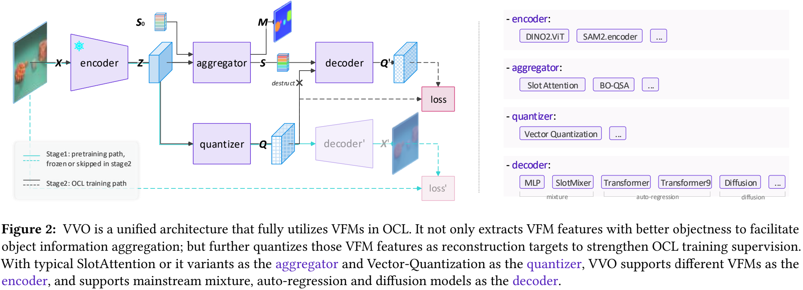
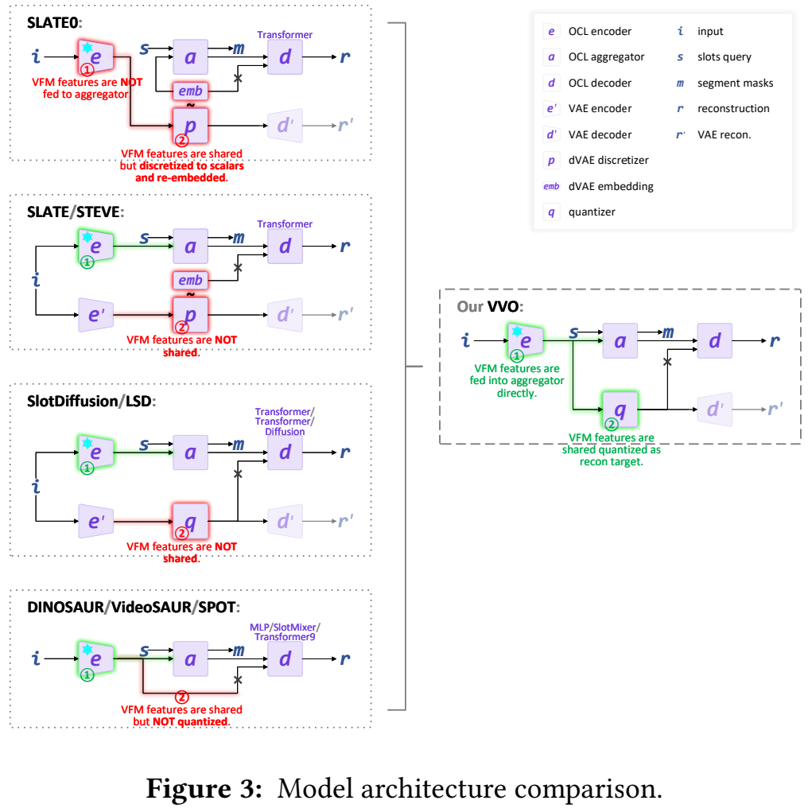
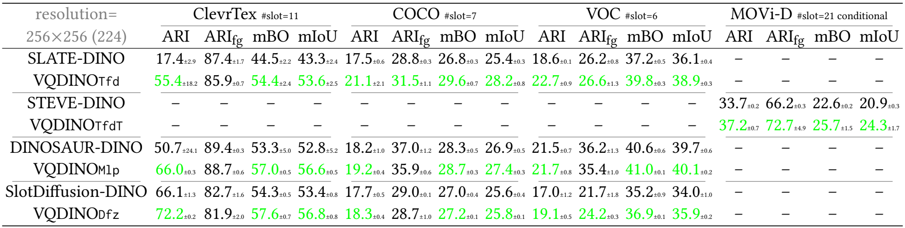
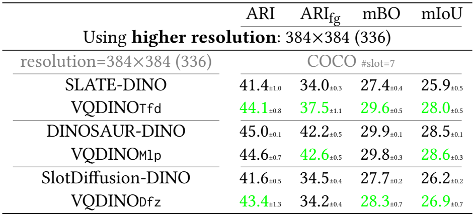
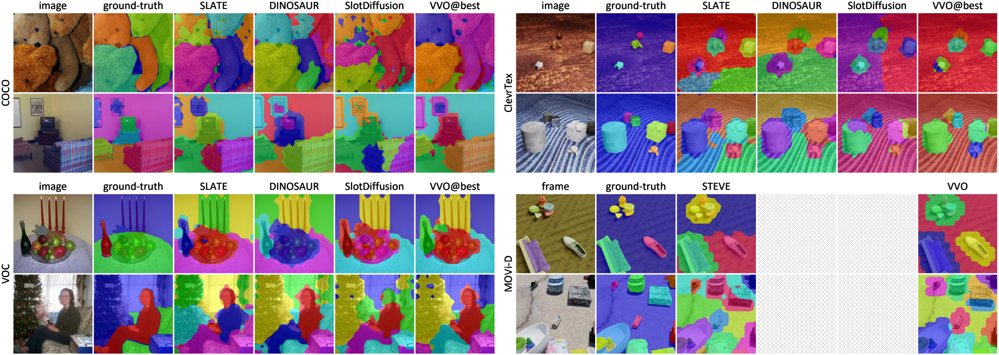
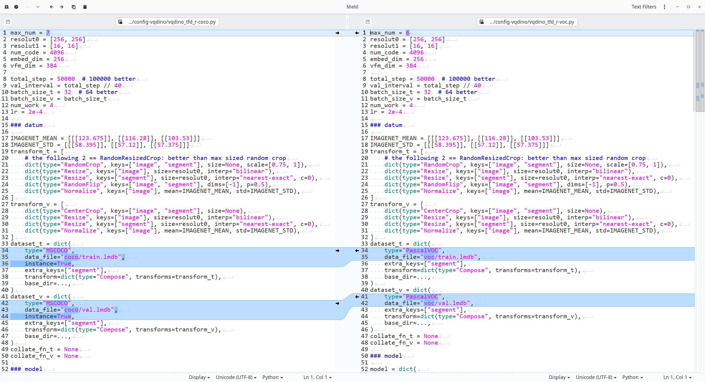

# VQ-VFM-OCL (VVO) : Vector-Quantized Vision Foundation Models for Object-Centric Learning


## About

Official implementation of paper "**Vector-Quantized Vision Foundation Models for Object-Centric Learning**" available on [arXiv:2502.20263](https://arxiv.org/abs/2502.20263).





Supported OCL methods include, categorized by OCL decoding:
- Auto-regressive decoding: [SLATE](https://github.com/singhgautam/slate) vs VVO-Tfd, [STEVE](https://github.com/singhgautam/steve) vs VVO-TfdT, [SPOT](https://github.com/gkakogeorgiou/spot) vs VVO-Tfd9
- Mixture-based decoding: [DINOSAUR](https://github.com/martius-lab/videosaur) vs VVO-Mlp, [VideSAUR](https://github.com/martius-lab/videosaur) vs VVO-SmdT
- Diffusion-based decoding: [SlotDiffusion](https://github.com/Wuziyi616/SlotDiffusion) vs VVO-Dfz

Object discovery performance with DINO2 ViT (s/14) for OCL encoding. VVO is instantiated as VQDINO; Tfd, TfdT, Mlp and Dfz are Transformer, Transformer-temporal, MLP and Diffusion for OCL decoding respectively.



Using higher resolution.



Qualitative  results.




## Stucture

```
- config-slatesteve  # configs for SLATE and STEVE
    └ *.py
- config-dinosaur  # configs for DINOSAUR
    └ *.py
- config-slotdiffusion  # configs for SlotDiffusion
    └ *.py
- config-vqdino  # configs forr VQDINO (VVO with DINO for OCL encoding)
    └ *.py
- object_centric_bench
    └ datum  # implementations of datasets ClevrTex, COCO, VOC and MOVi
        └ *.py
    └ model  # modules that compose OCL models
        └ *.py
    └ learn  # callbacks, metrics and optimizers
        └ *.py
    └ *.py
- convert.py
- train.py
- eval.py
- requirements.txt
```


## Features

- **fp16 fast training** [Automatic mixed precision](https://docs.pytorch.org/tutorials/recipes/recipes/amp_recipe.html) training (fp32+fp16) is enabled. Most of the training can be finished less than 8 hours using one V100 GPU.
- **less I/O overhead** Datasets are stored in [LMBD](https://lmdb.readthedocs.io) database format to save I/O overhead, beneficial especially on computing cluster.
- **config-driven experiment** This is totally config-driven framework, largely inspired by [OpenMMLab](https://github.com/open-mmlab), but with much less capsulation.
- **strong baselines** All models requiring VAE are implemented with StableDiffusion pretrained VAE [TinyVAE](https://huggingface.co/docs/diffusers/v0.30.1/en/api/models/autoencoder_tiny); All models are trained with [strong](https://arxiv.org/abs/2206.07764) data augmentations; All models employ vision foundation model [DINO2](https://huggingface.co/docs/transformers/en/model_doc/dinov2) as their backbone.


## Converted Datasets 🚀

Converted datasets, including ClevrTex, COCO, VOC and MOVi-D are available as [releases](https://github.com/Genera1Z/VQ-VFM-OCL/releases).
- [dataset-clevrtex](https://github.com/Genera1Z/VQ-VFM-OCL/releases/tag/dataset-clevrtex): converted dataset [ClevrTex](https://www.robots.ox.ac.uk/~vgg/data/clevrtex).
- [dataset-coco](https://github.com/Genera1Z/VQ-VFM-OCL/releases/tag/dataset-coco): converted dataset [COCO](https://cocodataset.org).
- [dataset-voc](https://github.com/Genera1Z/VQ-VFM-OCL/releases/tag/dataset-voc): converted dataset [VOC](http://host.robots.ox.ac.uk/pascal/VOC).
- [dataset-movi_d](https://github.com/Genera1Z/VQ-VFM-OCL/releases/tag/dataset-movi_d): converted dataset [MOVi-D](https://github.com/google-research/kubric/blob/main/challenges/movi).


## Model Checkpoints 🌟

***The checkpoints for all the models in the two tables above*** are available as [releases](https://github.com/Genera1Z/VQ-VFM-OCL/releases).
- [slatesteve](https://github.com/Genera1Z/VQ-VFM-OCL/releases/tag/slatesteve): SLATE on ClevrTex, COCO and VOC; STEVE on MOVi-D.
- [vqdino_tfd](https://github.com/Genera1Z/VQ-VFM-OCL/releases/tag/vqdino_tfd): VQDINO-Tfd on ClevrTex, COCO and VOC; VQDINO-TfdT on MOVi-D.
- [dinosaur](https://github.com/Genera1Z/VQ-VFM-OCL/releases/tag/dinosaur): DINOSAUR on ClevrTex, COCO and VOC.
- [vqdino_mlp](https://github.com/Genera1Z/VQ-VFM-OCL/releases/tag/vqdino_mlp): VQDINO-Mlp on ClevrTex, COCO and VOC.
- [slotdiffusion](https://github.com/Genera1Z/VQ-VFM-OCL/releases/tag/slotdiffusion): SlotDiffusion on ClevrTex, COCO and VOC.
- [vqdino_dfz](https://github.com/Genera1Z/VQ-VFM-OCL/releases/tag/vqdino_dfz): VQDINO-Dfz on ClevrTex, COCO and VOC.
- [vqdino-r384](https://github.com/Genera1Z/VQ-VFM-OCL/releases/tag/coco-r384): VQDINO-Tfd/Mlp/Dfz on COCO with resolution 384x384 (336x336).


## How to Use

#### (1) Install requirements

(Using Python version 3.11)
```shell
pip install -r requirements.txt
```
Use package versions no older than the specification.

#### (2) Prepare datasets

Convert original datasets into LMDB format: 
```shell
python convert.py
```
But **firstly** download original datasets according to docs of ```XxxDataset.convert_dataset()```.

#### (3) Pretrain and train

Run training:
```shell
python train.py
```
But **firstly** change the arguments marked with ```TODO XXX``` to your needs.

Specifically on training:
- For SLATE/STEVE, SlotDiffusion and VQDINO-Tfd/Mlp/Dfz, there are two stages for training. For example,
```shell
# 1. pretrain the VAE module
python train.py --cfg_file config-slatesteve/vqvae-coco-c256.py
# *. place the best VAE checkpoint at archive-slatesteve/vqvae-coco-c256/best.pth
mv save archive-slatesteve
# 2. train the OCL model
python train.py --cfg_file config-slatesteve/slate_r_vqvae-coco.py --ckpt_file archive-slatesteve/vqvae-coco-c256/best.pth
```
 - VQDINO-Tfd/Mlp models share the same ``config-vqdino/vqdino-xxx-c256.py`` and corresponding checkpoint as VAE pretraining;
 - VQDINO-Dfz models take ``config-vqdino/vqdino-xxx-c4.py`` and corresponding checkpoint as VAE pretraining.

- For DINOSAUR, there is only one training stage. For example,
```shell
python train.py --cfg-file config-dinosaur/dinosaur_r-coco.py
```

#### (4) Evaluate

Run evaluation:
```shell
python eval.py
```
Remember **firstly** modify the script according to your need.


## Tips

1. Any config file can be converted into typical Python code by changing from
```Python
...
model = dict(type="class_name", key1=value1,..)
...
```
to
```Python
from object_centric_bench.datum import *
from object_centric_bench.model import *
from object_centric_bench.learn import *
...
model = class_name(key1=value1,..)
...
```

2. All config files follow a similar structure, and you can use file comparator [Meld](https://meldmerge.org) with VSCode plugin [Meld Diff](https://marketplace.visualstudio.com/items?itemName=danielroedl.meld-diff) to check their differences.



## TODO

- SPOT & VVO-Tfd9: To be integrated into this framework;
- VideoSAUR & VVO-SmdT: To be integrated into this framework.


## About

I am now working on object-centric learning (OCL). If you have any cool ideas on OCL or issues about this repo, just contact me.
- WeChat: Genera1Z
- email: rongzhen.zhao@aalto.fi, zhaorongzhenagi@gmail.com


### Citation

If you find this repo useful, place cite our work.
```
@article{zhao2025vvo,
  title={{Vector-Quantized Vision Foundation Models for Object-Centric Learning}},
  author={Zhao, Rongzhen and Wang, Vivienne and Kannala, Juho and Pajarinen, Joni},
  journal={arXiv preprint arXiv:2502.20263},
  year={2025}
}
```
